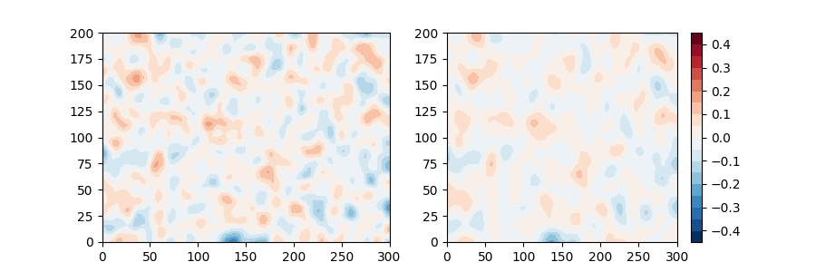

# Gridded post-processor

[](https://github.com/metno/gridpp/releases)
[](https://github.com/metno/gridpp/actions)

Gridpp a is post-processing tool for gridded weather forecasts. It consists of a **library** of commonly-used methods and a **command-line tool** that applies these methods to forecast fields in NetCDF files.

Gridpp is written in C++ but offers python bindings to the functions in the library. The tool is used at MET Norway to produce operational weather forecasts for Yr (https://www.yr.no).

Gridpp is currently under active development and the current version is a prototype for testing. Feedback
is welcome, either by using the issue tracker in Github, or by contacting Thomas Nipen (thomasn@met.no).

## Documentation
For information on how to use gridpp, check out the wiki at https://github.com/metno/gridpp/wiki. The API
reference is found at https://metno.github.io/gridpp/.

## Features
- Methods for **downscaling** a forecast from a coarse grid to a fine grid
- Methods for **calibrating** a downscaled grid, such as quantile mapping
- Computationally efficient **neighbourhood** methods to compute neighbourhood min, mean, max, and any quantile.
- Data assimilation using **optimal interpolation** (OI) to merge observations and gridded forecasts (deterministic or ensemble)
- Efficient data structures for nearest location lookup in a vector or grid of locations
- Command-line client with support for Netcdf files with flexibility in how variables and dimensions are configured

## Example

The following computes a moving neighbourhood mean with a half-width of 7 gridpoints (i.e. 15x15 neighbourhood)

```python
import gridpp
import numpy as np
import scipy.ndimage.filters
noise = np.random.randn(200, 300)
input = scipy.ndimage.filters.gaussian_filter(noise, sigma=5)
halfwidth = 7
output = gridpp.neighbourhood(input, halfwidth, gridpp.Mean)
```



## Required dependencies
- [Boost](https://www.boost.org/) >= 1.59
- [Armadillo](http://arma.sourceforge.net/) >= 6.6
- [GNU Scientific Library](https://www.gnu.org/software/gsl/)
- [Netcdf](https://www.unidata.ucar.edu/software/netcdf/)

## Install as RPM-package

## Install dependencies

    sudo yum install armadillo-devel boost-devel gsl-devel netcdf-devel swig \
    python3 python3-scipy python3-numpy python3-six

### Create RPM

Run command: 
    
    ./build_rpm.sh
    
### Install as RPM-package locally
    
Copy to repo:

    cp ~/rpmbuild/RPMS/x86_64/SMHI-gridpp-lib-<version>.x86_64.rpm /data/prod/linda/rpm-repository-linda/clientrepos/<host_name>

Update repo, utv: 

    createrepo /data/prod/linda/rpm-repository-linda/clientrepos/<host_name>
    
Install RPM: 

    sudo smhi-yum install SMHI-gridpp-lib
    
Update RPM: 

    sudo smhi-yum update SMHI-gridpp-lib
    
### Install as RPM-package into SMHI's server environment
    
Copy to repo, utv:

    cp ~/rpmbuild/RPMS/x86_64/SMHI-gridpp-lib-<version>.x86_64.rpm /data/prod/elin/kickstart/htdocs/yum/serverrepos/<server_name>

Copy to repo, test, prod: 
    
    cp ~/rpmbuild/RPMS/x86_64/SMHI-gridpp-lib-<version>.x86_64.rpm /data/prod/elin/kickstart/htdocs/yum/serverrepos/<server_name>
    
Update repo, utv: 

    createrepo /data/prod/elin/kickstart/htdocs/yum/serverrepos/<server_name>
    
Update repo, test, prod: 

    createrepo /data/prod/elin/kickstart/htdocs/yum/serverrepos/<server_name>
    
Install RPM: 

    sudo -i -u <gridpp_user_name>
    sudo smhi-yum --enablerepo=<server_name> install SMHI-gridpp-lib
    
Update RPM: 

    sudo -i -u <gridpp_user_name>
    sudo smhi-yum --enablerepo=<server_name> update SMHI-gridpp-lib

## Copyright and license
Copyright © 2014-2021 Norwegian Meteorological Institute. Gridpp is licensed under the GNU LEsser General
Public License (LGPL). See LICENSE file.

## Contact
E-mail: Thomas Nipen (thomasn@met.no)
